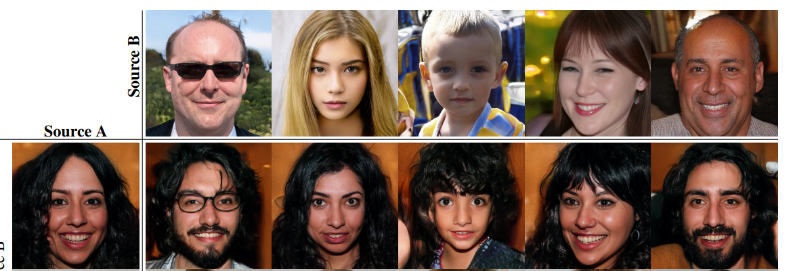
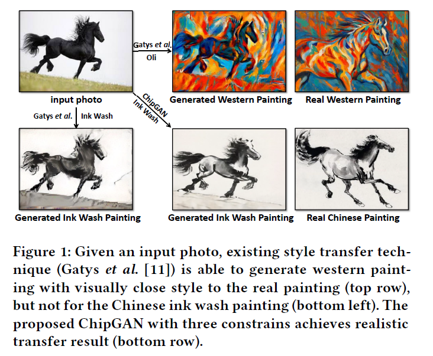

# Modelos generativos

¿Qué es un modelo generativo? Un modelo generativo es un sistema que aprende la distribución de probabilidad conjunta $P(x, y)$ de los datos de entrada $x$ y las etiquetas $y$ (o simplemente $P(x)$ en el caso no supervisado), permitiendo generar nuevas muestras sintéticas al muestrear de esta distribución aprendida.

Matemáticamente, dado un conjunto de datos $D = \{x_1, x_2, ..., x_n\}$, un modelo generativo busca aproximar la distribución subyacente $p_{data}(x)$ mediante una distribución paramétrica $p_\theta(x)$, donde $\theta$ son los parámetros del modelo. El objetivo es maximizar la verosimilitud:

$$
\theta = \arg \max_{\theta} \Pi_{i=1}^n p_{\theta}(x_i) = \arg \max_{\theta} \sum_{i=1}^n \log p_{\theta}(x_i)
$$

Una vez entrenado, el modelo puede generar nuevas muestras $x_{new} \sim p_{\theta}(x)$ que siguen la misma distribución que los datos de entrenamiento.

### Nuevas muestras

Pensad en que representa una imagen, una cara o un objeto. Todas las posibles combinaciones de pixeles que pueden encajar en el recuadro de esta imagen y cómo le diríais a un modelo que "aprenda caras". No es una tarea fácil.

Si quiero generar fotos de personas o audio con voces, de todas las imágenes posibles, de todos los ruidos posibles, hay un conjunto muy limitado de opciones que entendemos como "caras" o "voces". Pasa igual con el texto, podemos juntar letras de distinta manera pero solo combinaciones concretas dan como lugar a un idioma o un idioma concreto (español, sueco o japones, por ejemplo).

### Historia

**Primeros modelos**

Los modelos generativos han experimentado una evolución fascinante desde sus fundamentos teóricos hasta convertirse en una de las áreas más dinámicas del aprendizaje automático. Los primeros enfoques se basaron en modelos probabilísticos clásicos como las [máquinas de Boltzmann](https://en.wikipedia.org/wiki/Boltzmann_machine) y los modelos de [mezcla gaussiana](https://scikit-learn.org/stable/modules/mixture.html).

https://www.nature.com/articles/s41598-023-34652-4

Gracias a estos modelos empezamos a ver la aplicabilidad de estructuras donde se aprendiera una **representación latente** de los objetos que queríamos aprender. El problema es que no es tan fácil indicar que queremos aprender "algo" que represente a nuestros datos.

Contrastive divergence (Hinton) es una técnica que nos permite iterar sobre la red hasta encontrar la representación latente más representativa de los datos.

Se ha observado que esto permite codificar características clave (como en el caso de las redes convolucionales)

https://www.geeksforgeeks.org/dsa/types-of-boltzmann-machines/

**Autoencoders**

Los autoencoders son arquitecturas de redes neuronales diseñadas para aprender representaciones comprimidas (codificaciones) de los datos de entrada mediante un proceso de codificación-decodificación. 

https://www.geeksforgeeks.org/machine-learning/auto-encoders/

Consisten en dos componentes principales:

* **Encoder (Codificador)**: $f_{\phi}: X \rightarrow Z$ que mapea la entrada $x$ a una representación latente $z = f_{\phi}(x)$
* **Decoder (Decodificador)**: $g_{\theta}: Z \rightarrow X$ que reconstruye la entrada desde la representación latente $\hat{x} = g_{\theta}(z)$

Una vez entrenado, podemos usar solo parte de la red, el decoder, para generar nuevas muestras.

Posteriormente se extendió este modelo a nuevas arquitecturas como los Autoencoders Variacionales (VAEs) desarrollados por Kingma y Welling (2013) en "Auto-Encoding Variational Bayes" que establecieron otro paradigma fundamental basado en [inferencia variacional](https://www.cs.princeton.edu/courses/archive/fall11/cos597C/lectures/variational-inference-i.pdf).

**Generative Adversarial Networks**

Pero el verdadero punto de inflexión llegó en 2014 con la publicación del trabajo clave de Ian Goodfellow et al. "Generative Adversarial Nets", que introdujo las [Redes Generativas Adversariales](https://es.wikipedia.org/wiki/Red_generativa_adversativa) (GANs) y revolucionó el campo al proponer un marco de entrenamiento basado en la teoría de juegos entre dos redes neuronales. 

La evolución posterior ha sido vertiginosa: las GANs progresaron desde las versiones básicas hasta arquitecturas sofisticadas como DCGAN (Radford et al., 2015), StyleGAN (Karras et al., 2019) y BigGAN (Brock et al., 2018), mientras que los modelos autorregresivos como PixelRNN/PixelCNN (van den Oord et al., 2016) y los modelos de difusión (Ho et al., 2020) han demostrado capacidades excepcionales en generación de imágenes.

**StyleGAN**

* Video: https://www.youtube.com/watch?v=kSLJriaOumA&t=33s
* Artículo: https://arxiv.org/abs/1812.04948

Sobre generación realista: https://thisxdoesnotexist.com/

**ChipGAN**

**Nuevas arquitecturas**

Las arquitecturas de redes han ido evolucionando hasta encontrarnos con trabajos clave como _Attention is all you need_ [paper](https://arxiv.org/abs/1706.03762) donde se describe el modelo de atención que data como origen al modelo de red neuronal conocido como Transformers.

https://es.wikipedia.org/wiki/Transformador_(modelo_de_aprendizaje_autom%C3%A1tico)

El campo ha alcanzado nuevas cotas con modelos de lenguaje generativos como GPT (Radford et al., 2018-2023) y la reciente emergencia de modelos multimodales, consolidando los sistemas generativos como una tecnología transformadora en inteligencia artificial.

### Casos de uso

Exploraremos varios casos de uso que cubren un espectro más amplio que el de la generación de imágenes:

* Generación de datos sintéticos
* Aplicación a procesos de clasificación y segmentación
* Traducción de texto y texto-a-código
* Resumen y comprensión (NLU)

### Referencias Bibliográficas

* Goodfellow, I., Pouget-Abadie, J., Mirza, M., Xu, B., Warde-Farley, D., Ozair, S., ... & Bengio, Y. (2014). Generative adversarial nets. Advances in Neural Information Processing Systems, 27.
* Kingma, D. P., & Welling, M. (2013). Auto-encoding variational bayes. arXiv preprint arXiv:1312.6114.
* Radford, A., Metz, L., & Chintala, S. (2015). Unsupervised representation learning with deep convolutional generative adversarial networks. arXiv preprint arXiv:1511.06434.
* Karras, T., Laine, S., & Aila, T. (2019). A style-based generator architecture for generative adversarial networks. Proceedings of the IEEE/CVF Conference on Computer Vision and Pattern Recognition, 4401-4410.
* Brock, A., Donahue, J., & Simonyan, K. (2018). Large scale GAN training for high fidelity natural image synthesis. arXiv preprint arXiv:1809.11096.
* van den Oord, A., Kalchbrenner, N., & Kavukcuoglu, K. (2016). Pixel recurrent neural networks. International Conference on Machine Learning, 1747-1756.
* Ho, J., Jain, A., & Abbeel, P. (2020). Denoising diffusion probabilistic models. Advances in Neural Information Processing Systems, 33, 6840-6851.
* Radford, A., Narasimhan, K., Salimans, T., & Sutskever, I. (2018). Improving language understanding by generative pre-training. OpenAI Blog.